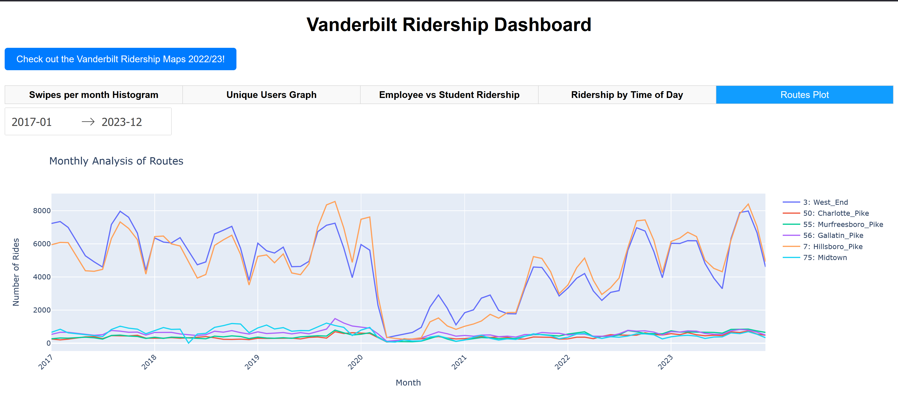

# Vanderbilt MoveVU Ridership Dashboard
<p align='center'>
  <a target="_blank" href='https://www.python.org/'></a>
  <a target="_blank" href='https://pandas.pydata.org/'></a>
 <a target="_blank" href='https://dash.plotly.com/'></a>
  <a target="_blank" href='https://flask.palletsprojects.com/en/3.0.x/'></a>
</p>


## Introduction
The Vanderbilt MoveVU Ridership Dashboard is an interactive application designed to visualize the ridership data of Nashville's bus routes. This dashboard utilizes Plotly and Dash to render dynamic visualizations, helping to explore trends and insights about the frequency and demographics of ridership across various bus routes.

## Prerequisites
To run this application, you need to have Python installed along with the following major libraries:
- Dash
- Pandas
- Plotly

Additionally, Conda is recommended for managing your Python environment and dependencies.

## Setting Up Your Environment
1. **Clone the repository**
    ```bash
    git clone https://github.com/SySyAli/vanderbilt_movevu.git
2. **Navigate to the project repository**:
    ```bash
    cd vanderbilt_movevu
1. **Install Conda**: Download and install Conda (Anaconda or Miniconda) from [Conda's official website](https://docs.conda.io/projects/conda/en/latest/user-guide/install/index.html).
2. **Create a Conda environment**: Open your terminal and run the following command to create a new environment:
   ```bash
   conda create --name movevu python=3.12
3. **Activate the enviroment using**:
    ```bash 
    conda activate movevu
4. **Install the required packages**. There are two ```requirements.txt```, one for the testing folder and one for the dashboard. Choose one based upon your needs. The main requirements.txt has the packages needed only for running the dashboard.
    ```bash
    conda install --file requirements.txt
5.  **Setup the parquet file**: Ensure you have the ```movevu.parquet``` in the root directory. If you only have ```.csv``` files, then look at the pandas documention to convert all of your data to a parquet.

## Running the Application
1. **Download the application files**: Ensure you have the ```app.py``` script in the root directory.
2. **Launch the dashboard**: With your Conda environment activated and the necessary files in place, run the following command from your terminal:
    ```bash
    python app.py
3. **Access the dashboard:** Open a web browser and navigate to ````http://127.0.0.1:8050/```` to view the Vanderbilt MoveVU Ridership Dashboard.

## Features
- **Data Visualization**: View different graphical representations of the data like histograms, bar charts, and line plots.
- **Interactive Elements**: Use tabs and date pickers to filter and view data across different dimensions such as time periods and rider demographics.
- **Dynamic Updates**: The graphs update dynamically based on user interactions with elements like date ranges and tab selections.

The testing directory contains some data analysis that was done to determine the visualizations used for the dashboard
